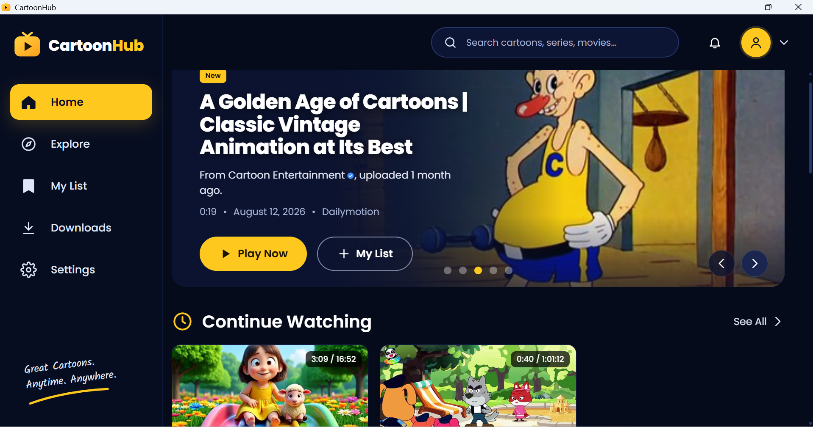
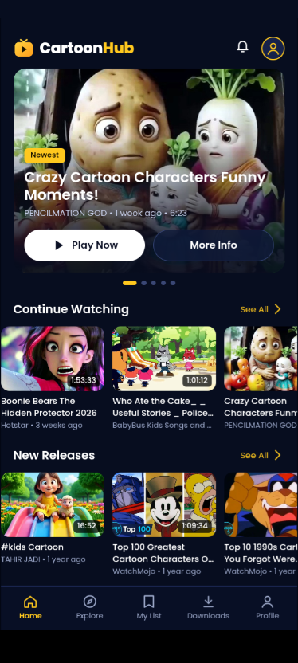

<p align="center"></p>

<h1 align="center">CartoonHub</h1>

<p align="center">A kid-friendly way to find and watch cartoons from Dailymotion, newest first.</p>

<p align="center">
  
  &nbsp;
  
</p>

CartoonHub searches [Dailymotion](https://www.dailymotion.com) for cartoons, sorts
the results by upload date, groups them (Today, This week, This month…) and plays
them in a simple built-in player. It remembers My List, Watch History and where you
stopped in each video, and has Parental Controls that switch on Dailymotion's own
family filter.

It has no server and no database. Each copy of the app does its own searching on
the device it runs on.

> [!IMPORTANT]
> **CartoonHub owns none of the content it shows.** Every video, title, thumbnail and
> channel belongs to its uploader and rights holders on Dailymotion. CartoonHub is
> not affiliated with or endorsed by Dailymotion. For the best and fullest
> experience, and to support the creators, watch on
> **[dailymotion.com](https://www.dailymotion.com)**. Every video in the app has an
> "Open on Dailymotion" link.

## Download

Get the latest version from **[Releases](https://github.com/01annanogero-coder/CartoonHub/releases/latest)**.

| Platform | File | Status |
| --- | --- | --- |
| Android 7.0+ | `CartoonHub-<version>.apk` | Available |
| Windows 10/11 | `CartoonHub-Setup-<version>.exe` | Available |
| macOS | build it yourself, see [Build from source](#build-from-source) | Not tested yet |
| Linux | build it yourself (AppImage) | Not tested yet |
| Any OS with a browser | the web dev server in `server/` | For development |
| iOS | not available | Planned |

**Android:** open the APK on your phone. Android asks you to allow installing apps
from your browser or file manager the first time.

**Windows:** run the installer. The app isn't code-signed yet, so Windows SmartScreen
may say "Windows protected your PC". Click **More info → Run anyway**.

## Automatic updates

Both apps check this repository's latest release when they start.

- **Windows:** a newer version downloads quietly in the background and installs when
  you close the app, so the next launch is already updated.
- **Android:** a newer APK downloads in the background, on Wi-Fi only. On the next
  launch Android's installer opens and you tap **Update**. The first time, Android
  asks you to allow CartoonHub to install apps.

## How it works

```
┌──────────── one app, running on your device ────────────┐
│  Web UI (HTML/CSS/JS)  ──/api──▶  local backend           │
│  app/assets/web                    │                      │
│                                    ├─ hidden browser ──▶ dailymotion.com/search
│                                    │   (hook.js reads the page's own search request,
│                                    │    replays it for more pages, sorts by date)
│                                    └─ stream proxy ───▶ Dailymotion's HLS video stream
└──────────────────────────────────────────────────────────┘
```

1. The UI asks the local backend for `/api/search?q=…`.
2. A hidden browser opens `dailymotion.com/search/<query>/videos`, the same page you'd see.
   [`hook.js`](app/assets/headless/hook.js) captures the page's own `SEARCH_QUERY` request,
   replays it for more pages, and returns the videos sorted newest first.
3. To play a video, the backend gets its HLS stream from inside a Dailymotion page and
   proxies the playlists and segments to the built-in player ([hls.js](https://github.com/video-dev/hls.js)).
   If that fails, the app falls back to Dailymotion's own embedded player.

The same web UI runs on every platform, and each platform supplies the backend:

| Folder | What it is | Backend | Hidden browser |
| --- | --- | --- | --- |
| [`app/`](app) | Flutter app for Android | `lib/local_server.dart` on `127.0.0.1` | Android WebView (`HeadlessBrowser.kt`, `StreamResolver.kt`) |
| [`desktop/`](desktop) | Electron app for Windows, macOS, Linux | `backend.js` on a private `app://` scheme, with no network port | a hidden Electron window |
| [`server/`](server) | Web dev server, any OS | Express on `localhost:5173` | Playwright Chromium |

In the desktop app the UI uses a sidebar layout. On a phone it uses a bottom tab bar.

## Build from source

### Android app

Needs the [Flutter SDK](https://docs.flutter.dev/get-started/install) and the Android SDK.

```sh
cd app
flutter pub get
flutter run                  # on a connected phone or emulator
flutter build apk --release  # → app/build/app/outputs/flutter-apk/app-release.apk
```

### Desktop app

Needs [Node.js](https://nodejs.org) 20 or newer.

```sh
cd desktop
npm install
npm start       # run from source
npm run dist    # build an installer for the OS you're on → desktop/dist/
```

`npm run dist` builds for the OS it runs on: an NSIS installer on Windows, a DMG on
macOS, an AppImage on Linux. See [desktop/README.md](desktop/README.md) for details.

### Web dev server

Handy for working on the UI in a normal browser.

```sh
cd server
npm install
npx playwright install chromium
npm start       # → http://localhost:5173  (add ?desktop for the desktop layout)
```

## Publishing a new version

1. Raise the version in `app/pubspec.yaml` (e.g. `1.1.0+2`) and `desktop/package.json` (`1.1.0`).
2. Build the APK and the Windows installer (see above).
3. Create a GitHub release tagged `v1.1.0` and attach:
   - `CartoonHub-1.1.0.apk` (the renamed `app-release.apk`)
   - `CartoonHub-Setup-1.1.0.exe`, `CartoonHub-Setup-1.1.0.exe.blockmap` and `latest.yml` from `desktop/dist/`

Android only installs an update that is signed with the same key as the installed app.
Keep building releases with the same signing key.

## License

CartoonHub's code is free and unencumbered software released into the public domain
([The Unlicense](LICENSE)): use it, copy it, change it, for any purpose.
Third-party parts keep their own licenses. hls.js, for example, is Apache 2.0.
See [THIRD_PARTY_NOTICES.md](THIRD_PARTY_NOTICES.md).
